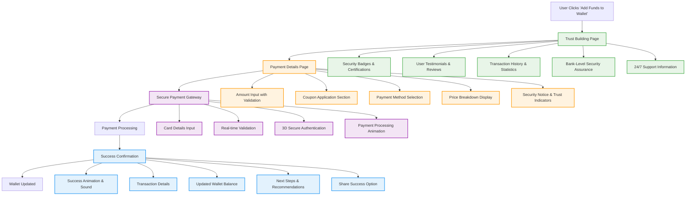

# Wallet Funding Flow - Trust Building & Payment Process

## Trust Building Elements

### 1. Security & Trust Indicators
- **SSL Certificate Badge**: "256-bit SSL Encrypted"
- **Bank-Level Security**: "Same security as your bank"
- **PCI DSS Compliant**: "Payment Card Industry certified"
- **ISO 27001 Certified**: "Information security certified"
- **Real-time Fraud Protection**: "AI-powered fraud detection"

### 2. Social Proof
- **User Testimonials**: "10,000+ satisfied customers"
- **Trust Score**: "4.9/5 stars from 5,000+ reviews"
- **Transaction Volume**: "₹50+ Crores processed securely"
- **Success Rate**: "99.9% successful transactions"

### 3. Support & Assurance
- **24/7 Support**: Live chat, phone, email
- **Money Back Guarantee**: "100% refund if not satisfied"
- **Instant Support**: "Average response time: 2 minutes"

## Interactive Payment Features

### 1. Real-time Validation
- Card number formatting and validation
- Expiry date validation
- CVV validation
- Amount validation with limits

### 2. Payment Method Options
- Credit/Debit Cards (Visa, MasterCard, RuPay)
- UPI (Google Pay, PhonePe, Paytm)
- Net Banking (All major banks)
- Digital Wallets

### 3. Enhanced Security
- 3D Secure authentication
- OTP verification
- Biometric authentication (mobile)
- Device fingerprinting

## Success Experience

### 1. Visual Confirmation
- Animated success checkmark
- Confetti animation
- Progress bar completion
- Success sound (optional)

### 2. Transaction Details
- Transaction ID
- Amount added
- Payment method used
- Timestamp
- Updated wallet balance

### 3. Next Steps
- Investment recommendations
- Project suggestions
- Educational content
- Referral program

### 4. Social Sharing
- Share success on social media
- Refer friends for bonus
- Leave a review
- Join community
